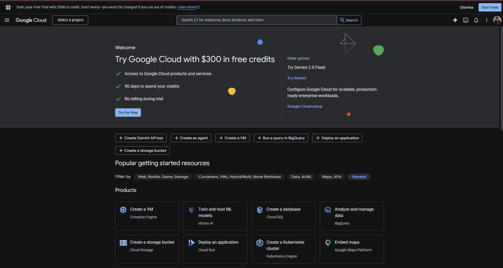
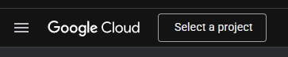
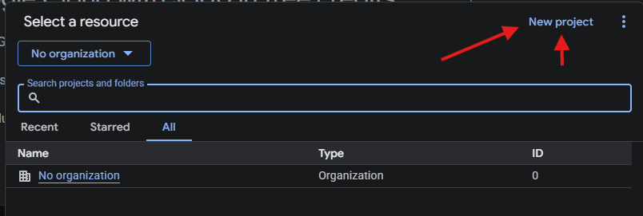
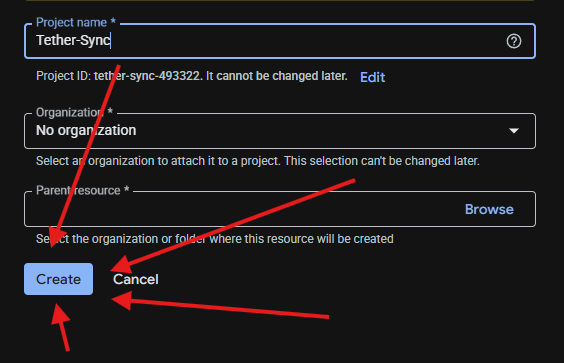

# Tether

A simple, structure-aware Google Drive sync engine for Obsidian, developed by **Llewellyn Paintsil**. Tether provides a seamless way to keep your entire vault—including settings, themes, and complex folder hierarchies—perfectly synced between your local device (Android/Desktop) and Google Drive using your own Google Cloud project so you control your data.

## 🌟 Key Features

### 📱 Full Android & Desktop Compatibility

Built specifically to bypass the limitations of mobile devices. Tether uses Obsidian's native `requestUrl` API to handle large network requests and file operations without triggering CORS errors or memory crashes on Android.

### 📁 Exhaustive Vault Structure Sync

- **Hidden Folders:** Syncs the `.obsidian` folder, ensuring your plugins, themes, hotkeys, and CSS snippets are identical across all devices.
- **Deep Nesting:** Supports vaults with complex sub-folder structures.
- **Vault Root Isolation:** Creates a dedicated folder named after your vault inside your chosen Google Drive directory.

### 🚀 Performance & Reliability

- **Resumable Uploads:** Uses Google's resumable upload protocol to handle files of any size with zero file size limits.
- **Auto-Pagination:** Correctly handles large vaults by automatically paginating through Google Drive API results.
- **Background Sync:** Automatically checks for updates on startup and at configurable intervals.

### 🛡️ Data Safety & Conflict Resolution

- **Keep Both Strategy:** If a file is edited on two devices simultaneously, Tether creates a `(conflict - timestamp)` copy. It **never** overwrites your local data during a conflict.
- **Mirror Deletions:** If you delete a file locally, it is automatically removed from Google Drive on the next sync.
- **Conflict Management:** View and open conflicted files directly from the sync sidebar to resolve them manually.

---

## 🛠️ Installation

1.  **Locate Plugin Folder:** Open your vault folder and navigate to `.obsidian/plugins/`.
2.  **Create Directory:** Create a folder named `tether-google-drive-sync`.
3.  **Transfer Files:** Copy the following 3 files from this project into that new folder:
    - `main.js`
    - `manifest.json`
    - `styles.css`
4.  **Enable Plugin:** Open Obsidian, go to `Settings > Community Plugins`, click the Refresh icon, and toggle **Tether** to ON.

---

## 🚀 Step-by-Step Setup Guide

Tether includes a **Setup Wizard** in the settings tab to guide you through these steps:

### Step 1: Create Google Cloud Credentials (Google Cloud Console)

1.  Go to [Google Cloud Console](https://console.cloud.google.com/)

2.  Click **"Select a project"**

3.  Click **"New project"**

4.  In the project name field, type **"Tether-Sync"**

5.  Click **"Create"** button.

6.  Click **"APIs & Services"**

7.  Click **"Library"**

8.  Click the **"Search for APIs & Services"** field.

9.  Type **"Google drive"**

10. Click **"google drive api"**

11. Click **"Google Drive API"**

12. Click **"Enable"**

13. Click **"OAuth consent screen"**

14. Click **"Get started"**

15. Click the **"App name"** field.

16. Type **"Tether-Sync"**

17. Click **User Support email**.

18. Click **your email**

19. Click **"External"**

20. Pick the developer's **"Email address"** (Developer contact info)

21. Click the **"I agree to the Google API Services: User Data Policy."** field.

22. Click the **"create"** button

23. Click **"Data Access"**

24. Click **"Add or remove scopes"**

25. Copy the scope string: `https://www.googleapis.com/auth/drive https://www.googleapis.com/auth/drive.metadata.readonly openid email`

26. Paste the string in the **"Manually add scopes"** field.

27. Click **"Add to table"**

28. Click **"Update"**

29. Click **"Save"**

30. Click **"Audience"**

31. Click **"Add users"**

32. Add your email as a user.

33. Click **"Clients"**

34. Click **"Create client"**

35. Choose **"Web application"** as the application type.

36. Type **"Tether Sync"** in the **"Name"** field.

37. Copy the redirect URI: `https://obsidian.md`

38. Click the **"Add URI"** icon.

39. Paste the redirect URI in the **"URIs 1"** field.

40. Click **"Create"**

41. Copy the **Client ID** and paste it in Tether's settings.

42. Copy the **Client Secret** and paste it in Tether's settings.

### Step 2: Authentication

1.  In Obsidian settings for Tether, click **"Open Login Page"**.
2.  Log in with your Google account.
3.  You will be redirected to `obsidian.md`. **Copy the entire URL** from your browser bar.
4.  Paste that URL into the **"Authorization Code"** box in Obsidian and click **Verify Code**.

### Step 3: Choose Folder

1.  Click **"Select Drive Folder"**.
2.  Browse your Google Drive hierarchy.
3.  Either select an existing folder or create a new one.
4.  Click **"Select This Folder"** to begin syncing.

---

## 🔗 Author

**Llewellyn Paintsil**

- GitHub: [@Llewellyn500](https://github.com/Llewellyn500)
- Project Repo: [Tether](https://github.com/Llewellyn500/tether)

## 📄 License

This project is licensed under the MIT License.
